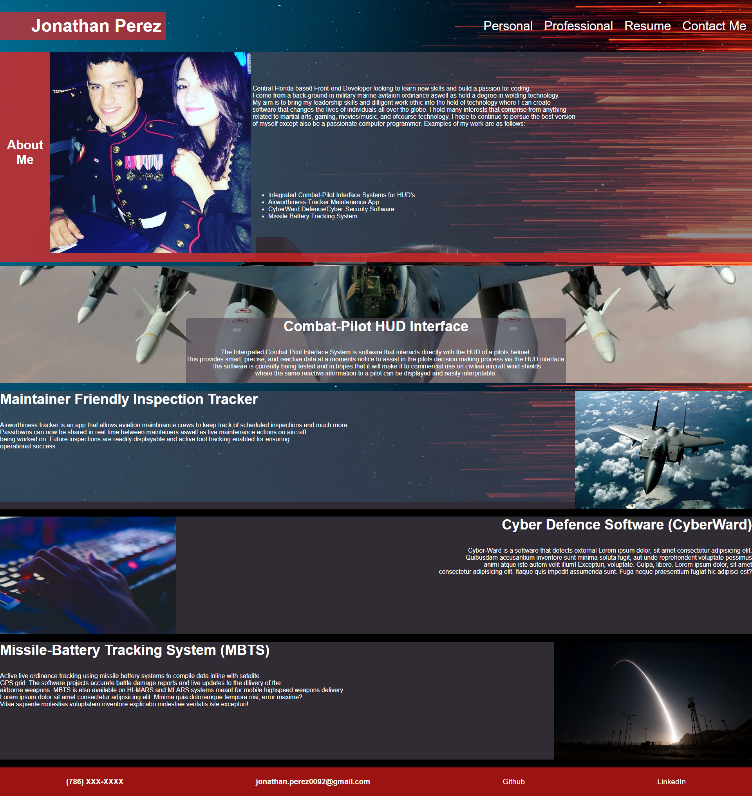

# Challenge-2  

## Portfolio
This website was built to illustrate my professional work and bootcamp projects
in order to showcase my skills and knowledge. I take great pride in building 
this website; I have learned a lot about working with flexbox and utalizing media queries in order to layout responsive content. I have so much to learn and improve on but for the amount of information I learned it seemed the motivation just followed and continues to. 
This website features placeholder projects to be changed, an about me and a contact me section complete with a nice header on top onto a neat background. 
My motivations stem from tom clancy novels and my professional background for this challenge.                                                                                                            

## Usage

## License
MIT

## Links

[Github](https://github.com/jon-dev092/challenge-2)                                
[Deployed Page]()